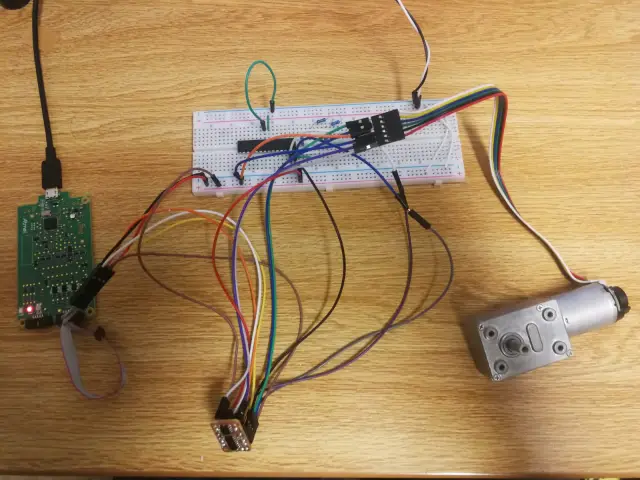
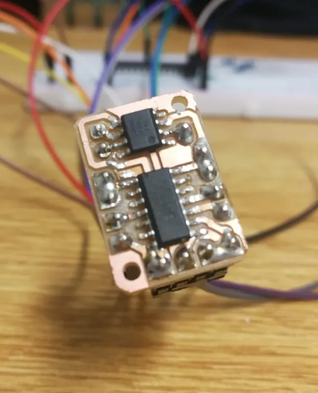

# 🌟 **Motor Control Driver for AVR with I2C Protocol** 🌟

## 📌 **Key Highlights**

- **Interrupt-Driven Feedback**: Dynamically monitors motor pin states to accurately detect direction and displacement.
- **PWM (Pulse Width Modulation) Configuration**: Enables precise speed and direction control of the motor.
- **Advanced Proportional-Integral-Derivative (PID) Logic**: Achieves the desired position and speed of the motor with utmost accuracy.

    
    

## 📚 **Table of Contents**

1. [Features Overview](#features-overview)
2. [Installation & Setup](#installation--setup)
3. [Usage Instructions](#usage-instructions)
4. [Contribution & Feedback](#contribution--feedback)
5. [License & Acknowledgments](#license--acknowledgments)

## 🚀 **Features Overview**

- **InitInterrupt Function**: Prepares the system for handling pin change interrupts and sets the relevant configurations.
- **PWM Timer Configuration**: Outlines the setup process to generate PWM signals.
- **Set Motor Direction**: Dynamically adjusts the motor's direction based on throttle and direction inputs.
- **Main Routine**: Houses the main logic and PID controller for motor operations.

## 🛠 **Installation & Setup**

1. **Dependencies**: 
    - Ensure you have the AVR library and toolchain installed.
    - `I2C.h` is required for interfacing with I2C devices.

2. **Configuration**: 
    - The `F_CPU` macro sets the clock speed. Adjust as per your microcontroller specifications.
    - The various #define macros such as `true`, `false`, `high`, and `low` provide better code readability.

3. **Deployment**:
    - Compile using the AVR toolchain.
    - Flash the binary to your AVR microcontroller.
    - Make sure to test the setup in a controlled environment before attaching it to the main system.

## 🎮 **Usage Instructions**

1. **Initialization**: Power up your system and make sure all connections are appropriately made.
2. **Calibration**: Ensure that the motor is calibrated and the feedback mechanism is functioning properly.
3. **Execution**: Power the microcontroller and observe the motor's behavior. Adjust the PID parameters for optimal performance as necessary.

## 🤝 **Contribution & Feedback**

Suggestions, issues, and pull requests are welcome! If you'd like to enhance the functionality or correct any anomalies:

1. Fork this repository.
2. Create your feature branch (`git checkout -b feature/YourFeature`).
3. Commit your changes (`git commit -am 'Added some feature'`).
4. Push to the branch (`git push origin feature/YourFeature`).
5. Create a new Pull Request.

## 📜 **License & Acknowledgments**

This project adheres to standard open-source licensing. Please check the licensing details for your application. A special thanks to all contributors, testers, and the broader AVR community for the continuous resources and inspiration.

---

✨ **Stay connected and follow our progress for more breakthroughs in microcontroller motor control!** ✨
